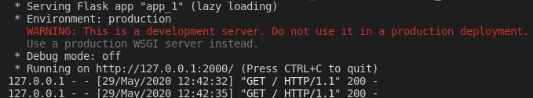
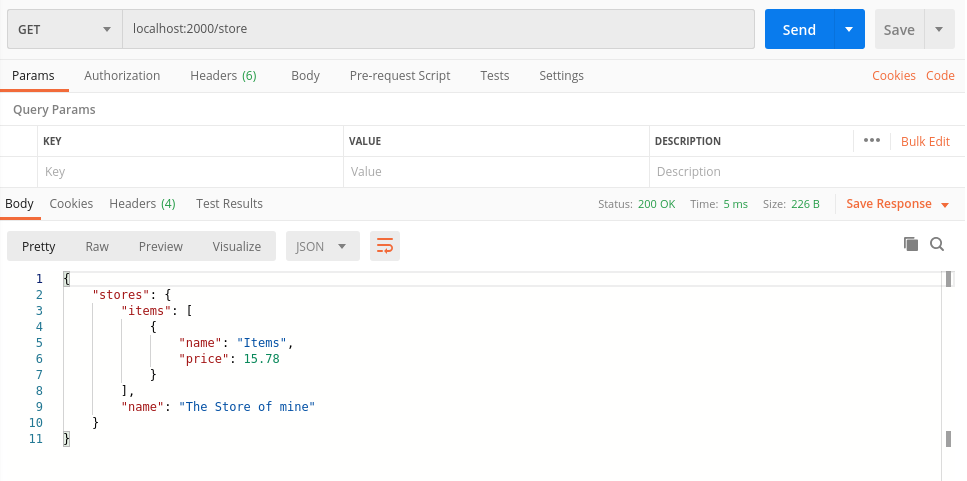

<h1>Flask Example</h1>

Este repositório tem como objetivo estudar melhor 
    o desenvolvimento de aplicativos web restful através do flask.
No exemplo dos arquivos .py que estão dentro da pasta python, foi feito um 
código simples para armazenar em SQLite dados e recuperá-los via comando de rotas.

Foi feito portanto um protótipo de CRUD com ações orientadas ao database em SQLite.

Alguns links Úteis:

<a href="https://flask.palletsprojects.com/en/1.1.x/">https://flask.palletsprojects.com/en/1.1.x/</a>

<a href="https://www.sqlite.org/index.html">https://www.sqlite.org/index.html</a>

<a href="https://www.anaconda.com/">https://www.anaconda.com/</a>

<a href="https://www.postman.com/">https://www.postman.com/</a>

<h3> Algumas instruções...</h3>

Para ter certeza que o projeto vai rodar é preciso ter instalado no python os seguintes pacotes:

-> <b>flask</b>

-> <b>flask_jwt</b>

-> <b>flask_restful</b>

Para rodar digite:

<code>python app_1.py</code>

ou

<code>python app.py</code>

Deverá aparecer algo como:

No postman é possível verificar o aplicativo funcionando corretamente:

